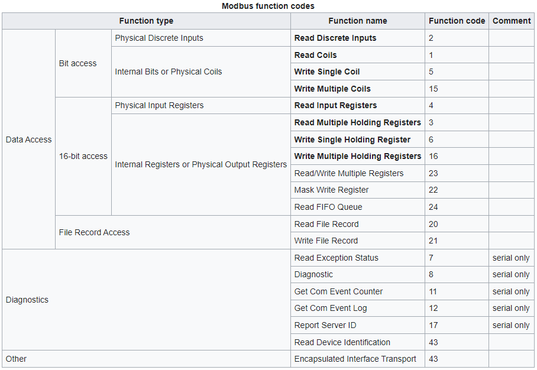

# Modbus

Modbus je otvorený protokol pre vzájomnú komunikáciu rôznych zariadení (RTU, PLC, dotykové displeje, I/O rozhrania apod), ktorý umožňuje prenášať dáta po rôznych sieťach a zberniciach. Komunikácia funguje na princípe predávánia datových správ mezi klientom a serverom (**master** a **slave**).

## Ako modbus funguje?

Zvyčajne býva jeden master a viacero slave zariadní (pri TCP môže byť viac mastrov). Inicializovať komunikáciu môže **iba master** a slave mu vždy len posiela odpoveď. 

Protokol modbus určuje že každé zariadenie má nejakú štruktúru paketu. Býva tam: 
- id ciela
- funkcia, ktorú chcem vykonať
- (optional) data
- CRC checksum

## Prenosové médiá

- Ethernet cez TCP/IP
- Sériový prenos (RS-232C, RS-422, RS-485, optické vlákno, radiový prenos)
- MODBUS PLUS vysokorychlostná sieť

Preferovaný je sériový prenos cez RS-485, za režimu linky 19200 baudov, 8 dátovych bitov a párna parita.

## Funkcie a úložisko

| Typ              | Operácia   | Veľkosť | Povolené adresy |
|------------------|------------|---------|-----------------|
| Coil             | Read-Write | 1 bit   | 0x0000 – 0xFFFF |
| Discrete input   | Read       | 1 bit   | 0x0000 – 0xFFFF |
| Input register   | Read       | 16 bits | 0x0000 – 0xFFFF |
| Holding register | Read-Write | 16 bits | 0x0000 – 0xFFFF |

## Zdroje

* https://modbus.org
* https://en.wikipedia.org/wiki/Modbus
* https://www.youtube.com/watch?v=JBGaInI-TG4
* https://www.npmjs.com/package/modbus-serial
* Meniče H-300 https://docs.google.com/document/d/1RQNIFq4vbOvbZFfxEuz4CkOA-SDlksPzpciTiBFUaeA/edit?usp=sharing
* https://www.youtube.com/watch?v=i46jdhvRej4