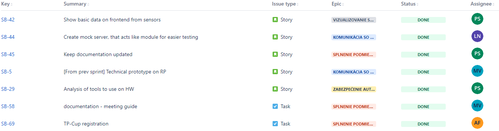
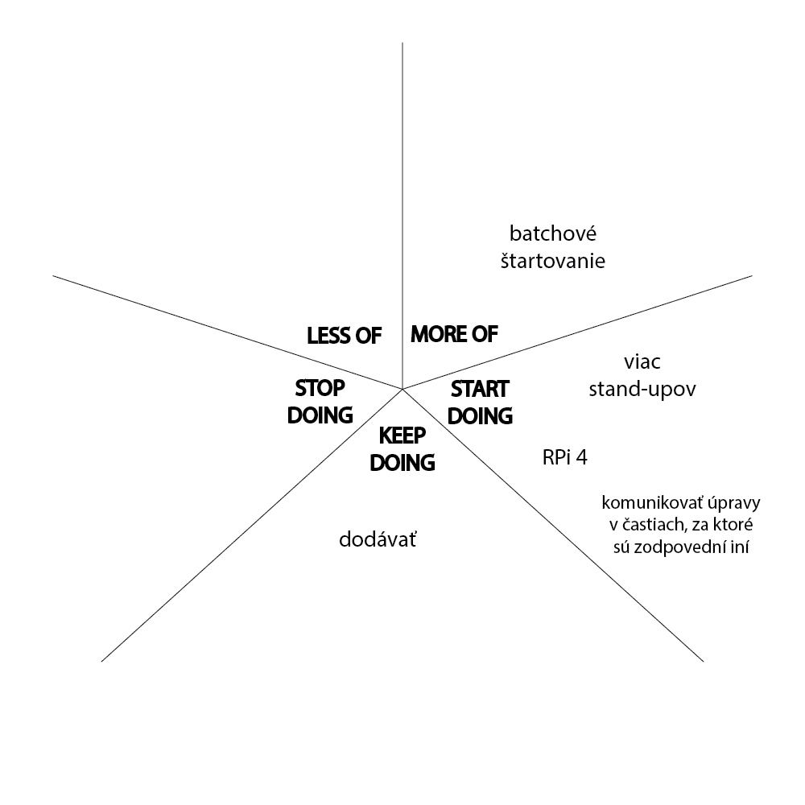

# Pilsner Urquell

## Kedy?

**Od:** 18.10.2021

**Do:** 2.11.2021

## Cieľ šprintu

Hlavnou úlohou tohto šprintu bolo vedieť si zobraziť nejaké údaje zo senzorov. 

Znamená to, že sme museli spraviť návrh grafického rozhrania. Návrh štruktúry [API](../technical_doc/architecture/api-reference.md) a komunikácie medzi časťami systému.

## Obsah šprintu

Hlavným story bolo zobrazenie údajov na grafickom rozhraní. Hlavne sa to týkalo zobrazenia akutálnej teploty, ktorú nameral teplomer.

### Show basic data on frontend from sensors

Hlavné story, pri ktorom bolo treba vytvoriť základné grafické rozhranie. Ďalej bolo treba umožniť získavanie najaktuálnejších dát z backendu. Takisto sme museli upraviť moduly, aby posielali správy o aktuálnom stave senzorov. Všetko toto zahrňovalo aj návrh komunikácie medzi jednotlivými komponentami spolu s jej implementáciou.

### Create mock server, that acts like module for easier testing

Vytvorenie testovacieho modulu, ktorý si vie každý člen tímu spustiť u seba lokálne. Dôležité to je preto, lebo nie každý má prístup k HW a aby sme si mohli otestovať jednotlivé časti, musíme nejako simulovať modul.

### Keep documentation updated

Story do ktorého sme dávali veci ako pridanie novej zápisnice, či prihlásenie sa do TP Cup.

### [[Zlatý bažant](./01.md)] Technical prototype on RP

Z predchádzajúceho šprintu sme tento story dokončili ihneď po stretnutí, keď sme si zadefinovali niečo, čo nám chýbalo pri poslednej pod-úlohe.

### [[Zlatý bažant](./01.md)] Analysis of tools to use on HW

Takisto z predchádzajúceho šprintu. Pričom bolo vykonaná analýza ohľadom zariadení na reguláciu teploty.

### [[Zlatý bažant](./01.md)] As a Team, we want to have a team webpage

Práca na tímovom webe bola minimálna. Jediné čo pribudlo, je odkaz na našu dokumentáciu priamo z webu v sekcií dokumenty. Farebné štýly boli upravené tak, aby dodržovali našu identitu.

## Výsledky šprintu

Nástroj [Jira](../technical_doc/guide/jira.md) nám ponúka nasledujúce vizualizácie hlavných stories a taskov. Podarilo sa nám spraviť 116.5/133 (87%) story pointov. Výsledný burndown graf nebudeme ukazovať, pretože nástroj Jira neponúka zobrazenie story pointov v sub-úlohách a výsledkom bolo to, že sme mali story s 90 bodmy, ktorý sme dokončili tesne pred koncom šprintu, čiže graf vyzeral akoby sme nič nerobili a zrazu väčšina zmizla.

### Splnené úlohy

### Nesplnené úlohy

### Poznámky do budúcna

Počas retrospektívy vznikol nasledujúci starfish diagram.

