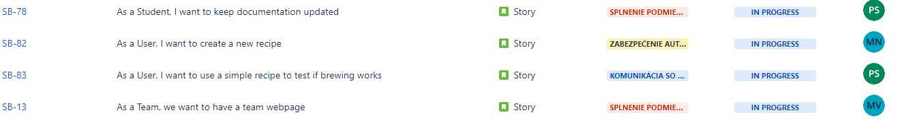
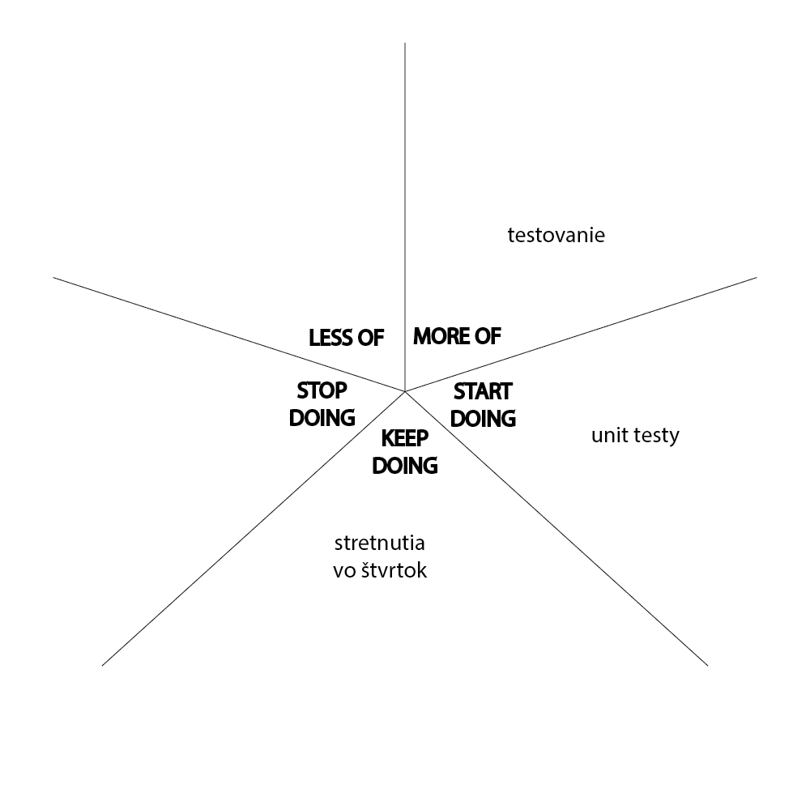
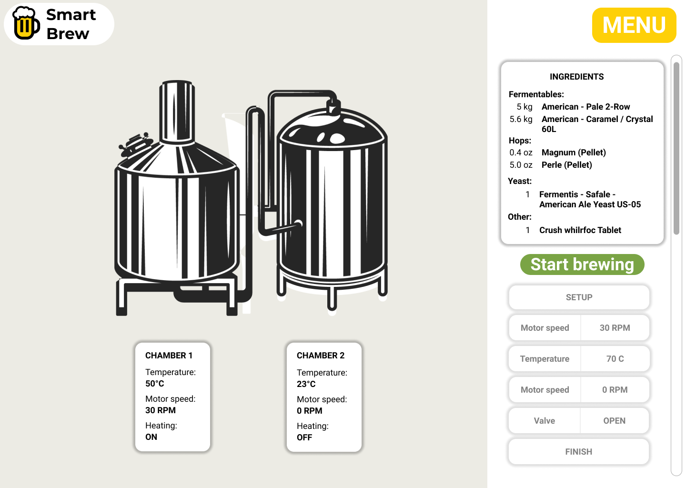
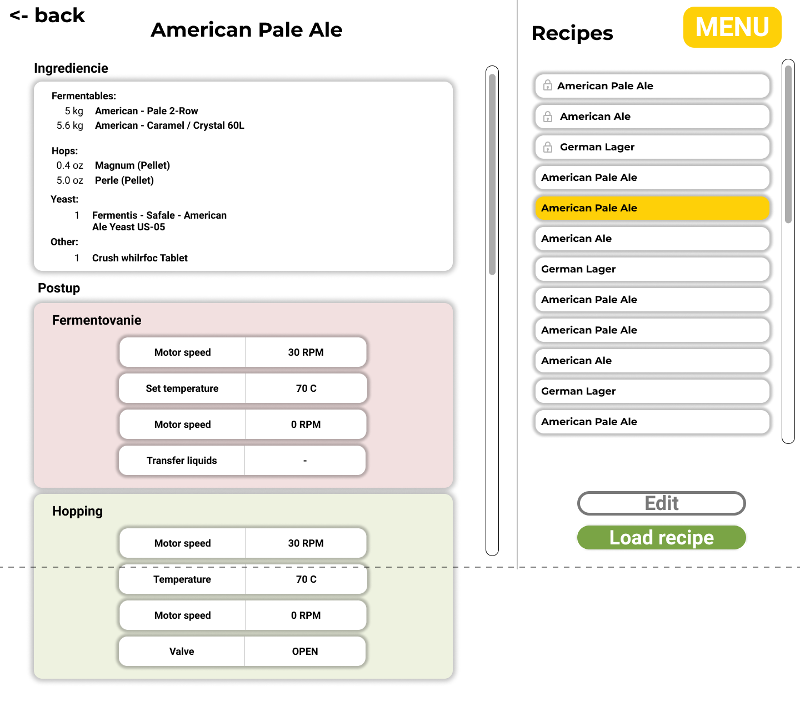
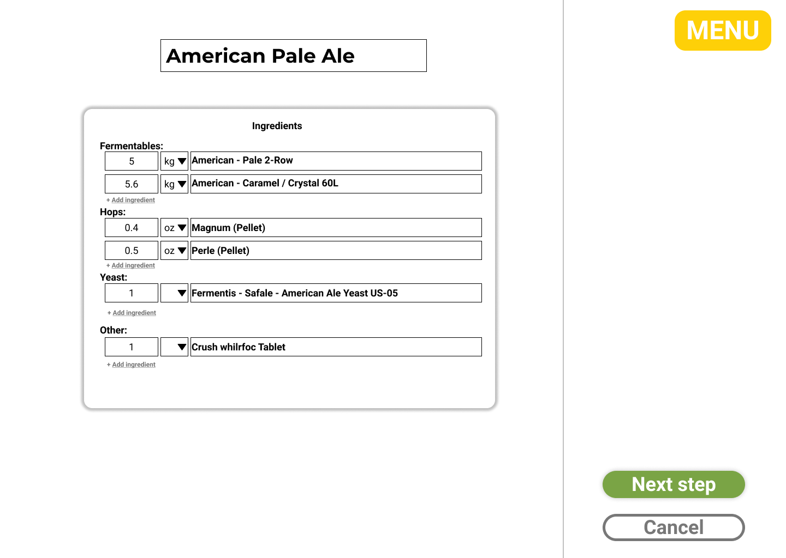
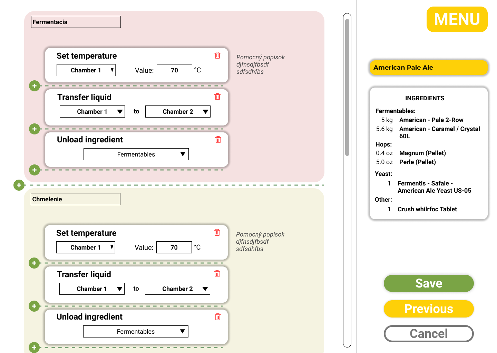
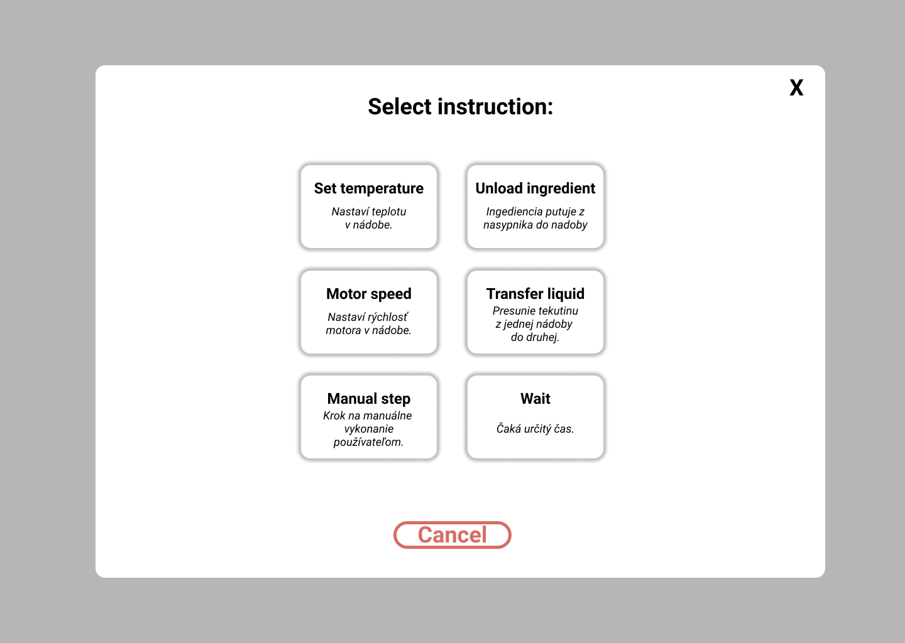

# Corgoň

## Kedy?

**Od:** 2.11.2021

**Do:** 15.11.2021

## Cieľ šprintu

Hlavným cieľom tohto šprintu bolo vedieť vytvoriť nový recept a následne tento recept použiť na varenie.

## Obsah šprintu

Bolo treba premyslieť grafické rozhranie a urobiť ho viac prívetivím pre používateľa (na konci stránky sú aj obrázky). Ďalej bolo treba zjednodišiť testovanie jednotlivých častí systému - testovací server a spúšťací script.

Hlavnou častou bolo vytváranie receptov a následné použitie týchto receptov na spústenie varenia. Čiže hlavná logika a proces akým sa presúvajú inštrukcie zo stavu `vykonávania` do `ukončeného` stavu.

### As a Developer, I want mock server to simulate instructions for brewing

Podpora vykonávania funkcií na testovacom servery.

### As a Developer, I want easier startup of every app

Jednoduchý script ktorý spustí celý systém (viac info [Spustenie pivovaru](../../technical-doc/guide/startup.md)).

### As a Student, I want to keep documentation updated

Klasická úloha vrámci ktorej sa vypisujú zápisnice či šprinty a podobné veci dokumentačného charakteru.

### As a User, I want to create a new recipe

Vytváranie nového receptu. Zahrňuje návrh GUI, zmeny v databáze a aj úpravu backendu.

### As a User, I want to use a simple recipe to test if brewing works

Aplikovanie receptu na varenie. Zahrňuje úpravu GUI, takisto aj logiku procesu varenia na backende a spracovanie inštrukcií na moduloch.

### [[Zlatý bažant](01.md)] As a Team, we want to have a team webpage

Práca na tímovom webe bola menšia. Pribudlo zopár textov, ktoré sme použili vrámci našej prihlášky do TP Cup.

## Výsledky šprintu

Nástroj [Jira](../../technical-doc/guide/jira.md) nám ponúka nasledujúce vizualizácie hlavných stories a taskov.

Podarilo sa spraviť hlavne backendovú časť celého šprintu, avšak na frontende vzniklo veľa problémov a preto sa tam nestihlo všetko dokončiť. Hlavná kostra tam už je, ale nieje to plne funkčné.

Vzhľadom na korona situáciu, sme nemohli veľa pracovať na úlohách a preto sa nestihli ani spraviť všetky zápisnice načas. Takisto sme si dali veľmi veľa úloh, ktoré boli veľmi náročné a aj preto sa nestihli dokončiť úplne.

### Splnené úlohy

### Nesplnené úlohy

### Poznámky do budúcna

Nedávať si až tak veľmi náročné ciele, lebo sa to potom nestíha spraviť a členovia tímu strácajú motiváciu.

## Návrh GUI

### Prehľadová obrazovka

### Výber receptu

### Vytváranie receptu (časť 1.)

### Vytváranie receptu (časť 2.)

### Vytváranie receptu (časť 2.) - detail

