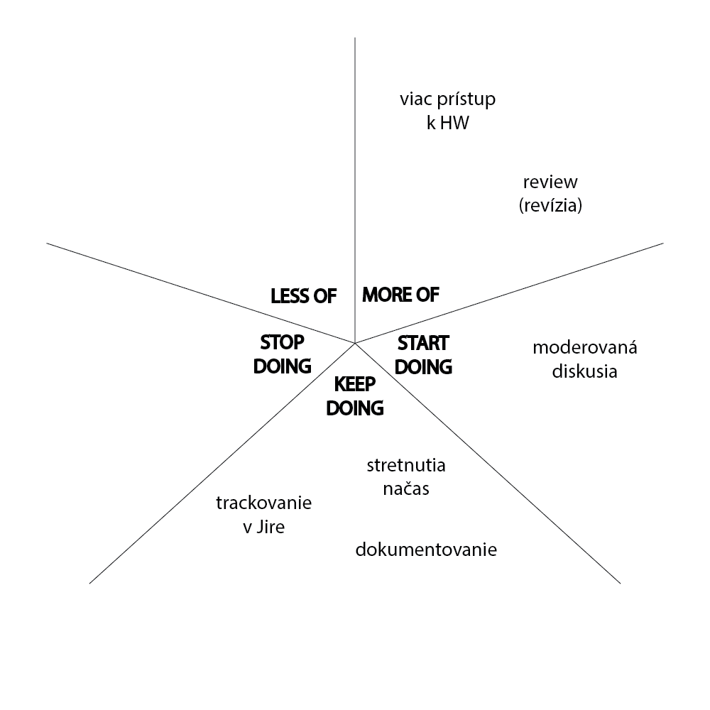
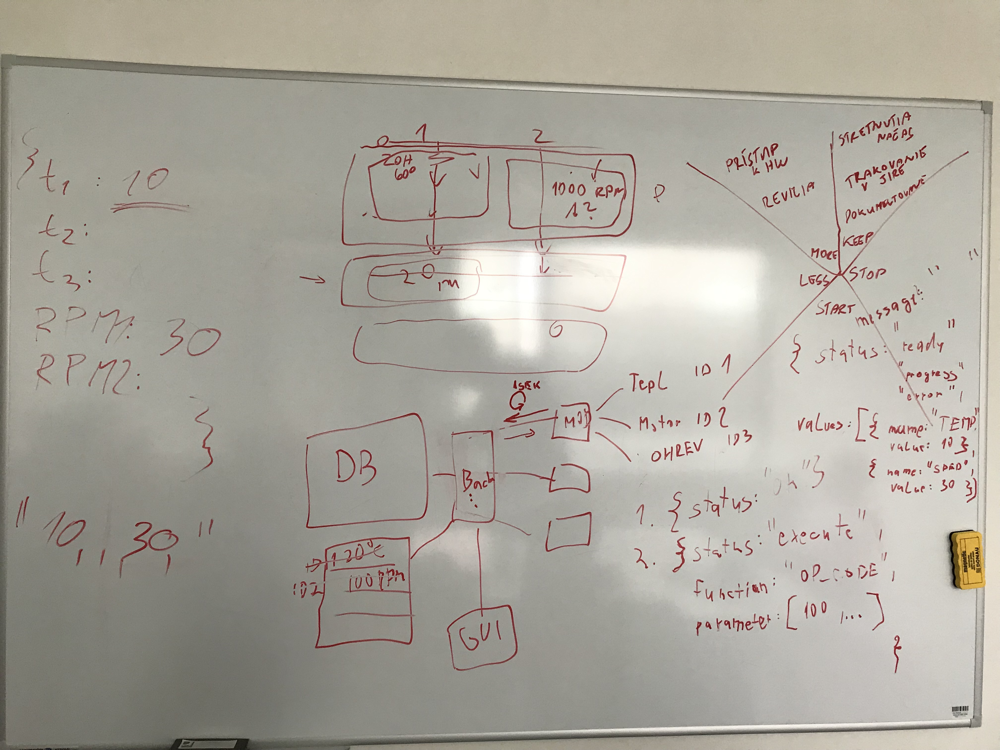

# Zápisnica - 18.10.2021

## Retrospektíva

## Zhrnutie taskov

Všetkým členom sa podarilo vypracovať tasky z minulého týždňa.

## Prezentácia vypracovaných taskov

Marek K. prezentoval svoj návrh relačno-entitného modelu DB. Po diskusii sme sa dohodli, že návrh
upraví kvôli identifikovaným problémom.

Miška prezentovala návrh front-endu vo Figme. Návrh spravili aj Saška a Peťo. Po diskusii sme sa dohodli, že
použijeme Peťov návrh.

## Identifikácia nových problémov

- Peťo potrebuje viac HW - kábliky a breadboard

### Komunikácia medzi BE a modulmi

- nebudeme využívať MQTT, ale WebSocket
- komunikácia bude ale stále vedená jednosmerne (modul si bude periodicky
  pýtať inštrukcie od BE)
- paralelizované budú len moduly medzi sebou, nie inštrukcie v rámci modulu (tie budú serializované)
 
### Potreba nových inštrukcií a krokov

#### Inštrukcia DELAY

Zabezpečuje čakanie modulu na ďalšiu inštrukciu. Modul si odpočet času bude zabezpečovať sám.

#### Krok ALERT

Krok upozorní používateľa, že je potreba vykonať niečo manuálne (napr. nasypať kvasnice, vybrať chmeľ, ...).

Front-end (aj back-end) by čakali na potvrdenie od používateľa, že danú vec vykonal.
    
### Logovanie

#### Priebeh varenia

- log - čas ; či to je chyba ; správa
- logovať sa budú všetky údaje dokopy (v jednom stĺpci)

#### Back-end

- logy z BE stačí ukladať do súborov

### Nedostupnosť HW pre testovanie

Potrebujeme testovací server, ktorý by simuloval moduly.

## Doplňujúce informácie

- FE si bude každú sekundu pýtať najnovšie dáta, ktoré si BE cachuje v objekte
- handlovanie správnosti hodnôt sa bude vykonávať na module (keby napr. boli vracané zlé teploty)

## Vytvorenie nových stories/taskov

### Stories

- hotový relačno-entitný model (spolu s validáciou a deploy skriptami)
- chceme vedieť na FE zobraziť teplotu - **definition of done**
    - musí byť možné vytvoriť recept, v ktorom bude inštrukcia "zvýš teplotu"
- virtuálny testovací modul

### Tasky

- definovať formáty JSONov pre komunikácie:
    - BE - modul
    - BE - FE
- **Lukáš** - vytvoriť testovací simulátor modulov
- **Miška, Saška** - definovať JSONy, ktoré bude FE posielať na BE a vice versa
- **Peťo** - vytvoriť stránku pre nový šprint v dokumentácii
- **Peťo** - práca na fyzickom zariadení
- **Marek K.** - upraviť návrh DB podľa diskusie
- **Marek V.** - vytvoriť API end-pointy pre komunikáciu s FE

## Diskusia

Dohodli sme sa, že je potreba viesť štruktúrovanejšiu a moderovanú diskusiu.
Marek V. navrhol metodiku pre vedenie diskusie.

### Nápady

Nasledujúce nápady spolu aj s nejakou úplne základnou štruktúrov údajov sme si aj nakreslili:

