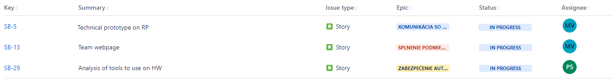

# Zlatý bažant

## Kedy?

**Od:** 3.10.2021

**Do:** 19.10.2021

## Cieľ šprintu

Úlohou prvého šprintu bol prvotný setup všetkých nástrojov akými sú Git, Jira či nástroj na tvorbu dokumentácie Docusaurus.

Ďalej bolo potrebné vytvoriť repozitáre pre jednotlivé časti projektu a v rámci nich vytvoriť jednoduché demo.

## Obsah šprintu

Krátky opis stories, na ktorých sme pracovali počas šprintu. Treba dodať že nie všetci členovia figurujú ako zodpovední za nejakú story, avšak na práci sa podielal každý. Každá story totiž obsahovala viacero úloh, ktoré sme už do tohto zápisu neuviedli, lebo ich bolo veľmi veľa (stories + úloh bolo cez 40).

### Technical prototype on RPI

Hlavný story. Prototyp pivovaru, ktorý sa automaticky bude nasadzovať na [RPI](../guide/rpi) a pri startupe sa naštartuje automaticky.

### Frontend analysis

Základný dizajn frontendu spolu s technológiami. Viac na [Frontend](../architecture/frontend).

### Analysis on how to brew a beer

Ako sa vôbec varí pivo, keďže väčšina členov tímu nevie aké sú tam kroky, a následne sa z tejto analýzy dá ľahšie zistiť, že čo treba spraviť. Viac na [Brewery](../analysis/brewery).

### Basic tools

Základné nastroje ktorými sú: [git](../guide/git), [jira](../guide/jira), [dokumentácia](http://team06-21.studenti.fiit.stuba.sk/docs).

### Architecture overview

High level pohľad na časti systému. Viac na [Architektúra](../architecture/database).

### Analyze existing SCADA software

Analýza iných softvérov, ktoré sú určné na podobné použite. Viac na [Scada](../analysis/scada).

### Team webpage

Základná tímová stránka.

### Analysis of tools to use on HW

Aké rôzne komponenty sa dajú použiť na HW. Viac na [Modbus](../analysis/modbus).

## Výsledky šprintu

Nástroj [Jira](../guide/jira) nám ponúka nasledujúce vizualizácie hlavných stories a taskov.

### Splnené úlohy

### Nesplnené úlohy

\*poznámka: _Technical prototype on RPI_ sa podarilo takmer celé a hlavná funkcionalita bola, avšak nepodarilo sa nám stihnúť jednu úlohu, ktorú bolo treba odkomunikovať s ostatnými členmi tímu až po ukončení šprintu.

### Poznámky do budúcna

Počas retrospektívy vznikol nasledujúci starfish diagram.

